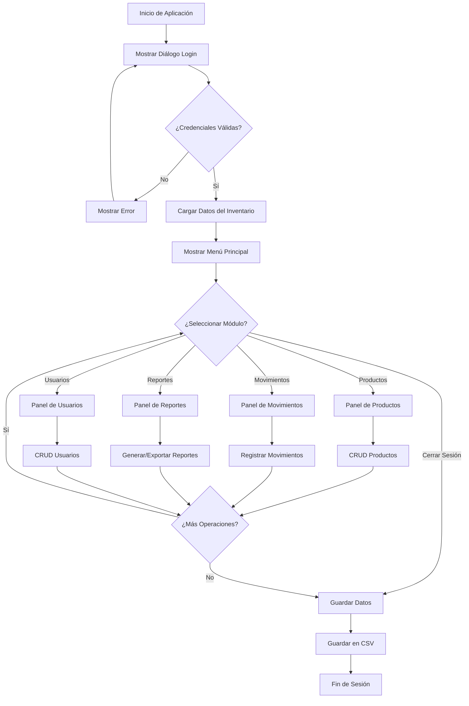

# Diagrama de Casos de Uso - Sistema de Gestión de Inventario

## Diagrama de Casos de Uso UML

```mermaid
graph TB
    subgraph Sistema["SISTEMA DE GESTIÓN DE INVENTARIO"]
        subgraph Autenticacion["🔐 AUTENTICACIÓN"]
            CU1["Iniciar Sesión"]
            CU2["Cerrar Sesión"]
            CU3["Recuperar Contraseña"]
        end

        subgraph GestionProductos["📦 GESTIÓN DE PRODUCTOS"]
            CU4["Crear Producto"]
            CU5["Consultar Productos"]
            CU6["Actualizar Producto"]
            CU7["Eliminar Producto"]
            CU8["Buscar Producto"]
            CU9["Registrar Entrada"]
            CU10["Registrar Salida"]
        end

        subgraph GestionUsuarios["👥 GESTIÓN DE USUARIOS"]
            CU11["Crear Usuario"]
            CU12["Consultar Usuarios"]
            CU13["Actualizar Usuario"]
            CU14["Eliminar Usuario"]
            CU15["Asignar Rol"]
        end

        subgraph Reportes["📊 REPORTES Y ANÁLISIS"]
            CU16["Ver Reportes"]
            CU17["Exportar Reporte PDF"]
            CU18["Consultar Productos Más Vendidos"]
            CU19["Consultar Bajo Stock"]
            CU20["Consultar Productos Agotados"]
        end

        subgraph Movimientos["📋 MOVIMIENTOS DE INVENTARIO"]
            CU21["Registrar Movimiento"]
            CU22["Ver Movimientos"]
            CU23["Ver Movimientos por Producto"]
            CU24["Ver Movimientos por Tipo"]
        end
    end

    %% Actores
    Admin["👨‍💼 ADMINISTRADOR"]
    Bodeguero["👨‍🔧 BODEGUERO"]
    Encargado["👨‍💻 ENCARGADO"]
    Sistema_["🖥️ SISTEMA"]

    %% Asociaciones Administrador
    Admin -->|Usar| CU1
    Admin -->|Usar| CU2
    Admin -->|Crear/Actualizar/Eliminar| CU4
    Admin -->|Crear/Actualizar/Eliminar| CU6
    Admin -->|Crear/Actualizar/Eliminar| CU7
    Admin -->|Ver| CU5
    Admin -->|Ver| CU8
    Admin -->|Registrar| CU9
    Admin -->|Registrar| CU10
    Admin -->|Crear/Actualizar/Eliminar| CU11
    Admin -->|Ver| CU12
    Admin -->|Actualizar| CU13
    Admin -->|Eliminar| CU14
    Admin -->|Asignar| CU15
    Admin -->|Ver| CU16
    Admin -->|Exportar| CU17
    Admin -->|Ver| CU18
    Admin -->|Ver| CU19
    Admin -->|Ver| CU20
    Admin -->|Ver| CU22

    %% Asociaciones Bodeguero
    Bodeguero -->|Usar| CU1
    Bodeguero -->|Usar| CU2
    Bodeguero -->|Ver| CU5
    Bodeguero -->|Ver| CU8
    Bodeguero -->|Registrar| CU9
    Bodeguero -->|Registrar| CU10
    Bodeguero -->|Ver| CU16
    Bodeguero -->|Ver| CU19
    Bodeguero -->|Ver| CU22

    %% Asociaciones Encargado
    Encargado -->|Usar| CU1
    Encargado -->|Usar| CU2
    Encargado -->|Registrar| CU9
    Encargado -->|Registrar| CU10
    Encargado -->|Ver| CU5
    Encargado -->|Ver| CU8
    Encargado -->|Actualizar cantidad| CU6
    Encargado -->|Ver| CU16
    Encargado -->|Ver| CU22

    %% Asociaciones del Sistema
    Sistema_ -.->|Valida credenciales| CU1
    Sistema_ -.->|Valida stock| CU10
    Sistema_ -.->|Notifica| CU19
    Sistema_ -.->|Genera| CU17
    Sistema_ -.->|Calcula| CU18

    style Admin fill:#4a90e2
    style Bodeguero fill:#7ed321
    style Encargado fill:#f5a623
    style Sistema_ fill:#bd10e0
    style Autenticacion fill:#f0f0f0
    style GestionProductos fill:#f0f0f0
    style GestionUsuarios fill:#f0f0f0
    style Reportes fill:#f0f0f0
    style Movimientos fill:#f0f0f0
```



---

## Descripción Detallada de Casos de Uso

### 🔐 **AUTENTICACIÓN**

| Caso de Uso | Descripción | Actor Principal | Precondiciones |
|---|---|---|---|
| **CU1: Iniciar Sesión** | El usuario ingresa correo y contraseña para acceder al sistema | Todos | Sistema iniciado |
| **CU2: Cerrar Sesión** | El usuario cierra su sesión actual | Todos | Usuario autenticado |
| **CU3: Recuperar Contraseña** | El usuario solicita reseteo de contraseña | Todos | Cuenta registrada |

**Flujo CU1 - Iniciar Sesión:**
1. Sistema muestra diálogo de login
2. Usuario ingresa correo y contraseña
3. Sistema valida credenciales
4. Si es válido → Usuario autenticado, accede a menú principal
5. Si es inválido → Mensaje de error, reintentar

---

### 📦 **GESTIÓN DE PRODUCTOS**

| Caso de Uso | Descripción | Actores | Restricciones |
|---|---|---|---|
| **CU4: Crear Producto** | Agregar nuevo producto al inventario | Administrador | Código único |
| **CU5: Consultar Productos** | Ver lista de productos | Todos autenticados | Filtros disponibles |
| **CU6: Actualizar Producto** | Modificar datos del producto | Administrador, Encargado | ID existe |
| **CU7: Eliminar Producto** | Remover producto del sistema | Administrador | Sin movimientos asociados |
| **CU8: Buscar Producto** | Buscar por nombre o código | Todos autenticados | Parámetro de búsqueda |
| **CU9: Registrar Entrada** | Agregar stock por compra/devolución | Administrador, Bodeguero, Encargado | Producto existe |
| **CU10: Registrar Salida** | Descontar stock por venta | Administrador, Bodeguero, Encargado | Stock suficiente |

**Flujo CU4 - Crear Producto:**
```
1. Admin selecciona "Nuevo Producto"
2. Sistema abre formulario
3. Admin ingresa: nombre, descripción, tallas, precio, cantidad, código, categoría
4. Sistema valida que código sea único
5. Sistema valida que precio y cantidad sean >= 0
6. Se guarda el producto → Confirmación
```

**Flujo CU10 - Registrar Salida:**
```
1. Usuario selecciona producto a descontar
2. Sistema valida que tenga stock suficiente
3. Usuario ingresa cantidad a descontar y motivo
4. Sistema actualiza stock del producto
5. Se crea movimiento de tipo SALIDA
6. Se incrementa contador de ventas → Confirmación
```

---

### 👥 **GESTIÓN DE USUARIOS**

| Caso de Uso | Descripción | Actor | Precondiciones |
|---|---|---|---|
| **CU11: Crear Usuario** | Registrar nuevo usuario en el sistema | Administrador | Correo único |
| **CU12: Consultar Usuarios** | Ver lista de usuarios | Administrador | Sesión iniciada |
| **CU13: Actualizar Usuario** | Modificar datos de usuario | Administrador | Usuario existe |
| **CU14: Eliminar Usuario** | Remover usuario del sistema | Administrador | Usuario existe |
| **CU15: Asignar Rol** | Definir rol (Admin/Bodeguero/Encargado) | Administrador | Usuario creado |

**Flujo CU11 - Crear Usuario:**
```
1. Admin selecciona "Nuevo Usuario"
2. Sistema abre formulario con roles disponibles
3. Admin ingresa: nombre, correo, contraseña, rol, datos específicos del rol
4. Sistema valida correo único y formato válido
5. Sistema valida contraseña (mínimo 6 caracteres, por ejemplo)
6. Se crea usuario → Confirmación
```

---

### 📊 **REPORTES Y ANÁLISIS**

| Caso de Uso | Descripción | Actores | Información |
|---|---|---|---|
| **CU16: Ver Reportes** | Visualizar dashboard de reportes | Todos autenticados | Resumen general, estadísticas |
| **CU17: Exportar Reporte PDF** | Descargar reporte en formato PDF | Administrador | Productos, movimientos, análisis |
| **CU18: Consultar Más Vendidos** | Ver Top 5 productos más vendidos | Todos autenticados | Ranking de ventas |
| **CU19: Consultar Bajo Stock** | Identificar productos con stock bajo | Todos autenticados | Alertas de inventario |
| **CU20: Consultar Agotados** | Ver productos sin stock | Todos autenticados | Productos con cantidad = 0 |

**Flujo CU17 - Exportar Reporte PDF:**
```
1. Admin selecciona "Exportar PDF"
2. Sistema abre diálogo de guardado de archivo
3. Admin selecciona ubicación y nombre
4. Sistema genera PDF con:
   - Resumen general (total productos, stock, valor)
   - Top 5 productos más vendidos
   - Productos con bajo stock
   - Productos agotados
   - Tabla completa de inventario
5. Se guarda archivo → Confirmación
```

---

### 📋 **MOVIMIENTOS DE INVENTARIO**

| Caso de Uso | Descripción | Actores | Datos |
|---|---|---|---|
| **CU21: Registrar Movimiento** | Crear entrada o salida | Admin, Bodeguero, Encargado | Tipo, producto, cantidad, motivo |
| **CU22: Ver Movimientos** | Historial completo | Todos autenticados | Fecha, usuario, cantidad |
| **CU23: Ver Movimientos por Producto** | Historial específico | Todos autenticados | Movimientos del producto |
| **CU24: Ver Movimientos por Tipo** | Filtrar entradas/salidas | Todos autenticados | Solo ENTRADA o solo SALIDA |

---

## Matriz de Permisos por Rol

```
┌─────────────────────────────────────┬──────────┬───────────┬──────────┐
│          FUNCIONALIDAD              │  ADMIN   │ BODEGUERO │ENCARGADO │
├─────────────────────────────────────┼──────────┼───────────┼──────────┤
│ Crear Producto                      │    ✓     │     ✗     │    ✗     │
│ Actualizar Producto                 │    ✓     │     ✗     │    ✓*    │
│ Eliminar Producto                   │    ✓     │     ✗     │    ✗     │
│ Consultar Productos                 │    ✓     │     ✓     │    ✓     │
│ Buscar Producto                     │    ✓     │     ✓     │    ✓     │
│ Registrar Entrada                   │    ✓     │     ✓     │    ✓     │
│ Registrar Salida                    │    ✓     │     ✓     │    ✓     │
│ Crear Usuario                       │    ✓     │     ✗     │    ✗     │
│ Consultar Usuarios                  │    ✓     │     ✗     │    ✗     │
│ Actualizar Usuario                  │    ✓     │     ✗     │    ✗     │
│ Eliminar Usuario                    │    ✓     │     ✗     │    ✗     │
│ Asignar Rol                         │    ✓     │     ✗     │    ✗     │
│ Ver Reportes                        │    ✓     │     ✓     │    ✓     │
│ Exportar Reporte PDF                │    ✓     │     ✗     │    ✗     │
│ Ver Más Vendidos                    │    ✓     │     ✓     │    ✓     │
│ Ver Bajo Stock                      │    ✓     │     ✓     │    ✓     │
│ Ver Agotados                        │    ✓     │     ✓     │    ✓     │
│ Ver Movimientos                     │    ✓     │     ✓     │    ✓     │
└─────────────────────────────────────┴──────────┴───────────┴──────────┘

* Encargado solo puede actualizar cantidades
✓ = Permiso concedido
✗ = Permiso denegado
```

---

## Flujo Principal de la Aplicación



---

## Información de Contacto y Soporte

**Sistema**: Gestión de Inventario STF GROUP  
**Versión**: 1.0  
**Actores**: Administrador, Bodeguero, Encargado  
**Plataforma**: Java Swing (Desktop)
