# Diagrama de Clases - Sistema de Gestión de Inventario

## Diagrama de Clases UML

```mermaid
classDiagram
    %% Clases Base Abstractas
    class Entidad {
        #id: int
        #fechaCreacion: LocalDateTime
        +getId(): int
        +setId(int): void
        +getFechaCreacion(): LocalDateTime
        +setFechaCreacion(LocalDateTime): void
    }

    class Usuario {
        #nombre: String
        #correo: String
        #contraseña: String
        #rol: Rol
        +getNombre(): String
        +setNombre(String): void
        +getCorreo(): String
        +setCorreo(String): void
        +getContraseña(): String
        +setContraseña(String): void
        +getRol(): Rol
        +setRol(Rol): void
        +obtenerPermisos()* String
        +verificarCredenciales(String, String)* boolean
    }

    %% Enums
    class Rol {
        <<enumeration>>
        ADMINISTRADOR
        BODEGUERO
        ENCARGADO
    }

    class TipoMovimiento {
        <<enumeration>>
        ENTRADA
        SALIDA
    }

    %% Roles de Usuario
    class Administrador {
        -departamento: String
        +getDepartamento(): String
        +setDepartamento(String): void
        +obtenerPermisos(): String
    }

    class Bodeguero {
        -ubicacionBodega: String
        +getUbicacionBodega(): String
        +setUbicacionBodega(String): void
        +obtenerPermisos(): String
    }

    class Encargado {
        -seccion: String
        +getSeccion(): String
        +setSeccion(String): void
        +obtenerPermisos(): String
    }

    %% Modelos de Negocio
    class Producto {
        -nombre: String
        -descripcion: String
        -tallas: String
        -precio: double
        -cantidad: int
        -codigo: String
        -categoria: String
        -ventasTotal: int
        +getNombre(): String
        +setNombre(String): void
        +getPrecio(): double
        +setPrecio(double): void
        +getCantidad(): int
        +setCantidad(int): void
        +getCodigo(): String
        +getCategoria(): String
        +getTallas(): String
        +setTallas(String): void
        +getVentasTotal(): int
        +setVentasTotal(int): void
        +aumentarStock(int): void
        +reducirStock(int): void
        +tieneSuficienteStock(int): boolean
        +incrementarVentas(int): void
    }

    class MovimientoInventario {
        -tipo: TipoMovimiento
        -productoId: int
        -cantidad: int
        -motivo: String
        -usuarioResponsable: String
        +getTipo(): TipoMovimiento
        +setTipo(TipoMovimiento): void
        +getProductoId(): int
        +setProductoId(int): void
        +getCantidad(): int
        +setCantidad(int): void
        +getMotivo(): String
        +setMotivo(String): void
        +getUsuarioResponsable(): String
        +setUsuarioResponsable(String): void
    }

    class Proveedor {
        -nombre: String
        -contacto: String
        -correo: String
        -telefono: String
        -direccion: String
        +getNombre(): String
        +setNombre(String): void
        +getContacto(): String
        +setContacto(String): void
        +getCorreo(): String
        +setCorreo(String): void
        +getTelefono(): String
        +setTelefono(String): void
        +getDireccion(): String
        +setDireccion(String): void
        +obtenerDescripcion(): String
    }

    %% Controladores
    class ControladorProducto {
        -productos: List~Producto~
        -gestorCSV: ProductoCSV
        -proximoId: int
        +cargarProductos(): void
        +guardarProductos(): void
        +crearProducto(...): Producto
        +actualizarProducto(int, ...): void
        +eliminarProducto(int): void
        +obtenerProductoPorId(int): Producto
        +buscarPorNombre(String): List~Producto~
        +obtenerTodos(): List~Producto~
        +obtenerProductosMasVendidos(int): List~Producto~
        +obtenerCantidadTotalProductos(): int
        +obtenerValorTotalInventario(): double
        +obtenerProductosBajoStock(int): List~Producto~
    }

    class ControladorUsuario {
        -usuarios: List~Usuario~
        -gestorCSV: UsuarioCSV
        -proximoId: int
        -usuarioActual: Usuario
        +cargarUsuarios(): void
        +guardarUsuarios(): void
        +autenticar(String, String): Usuario
        +cerrarSesion(): void
        +obtenerUsuarioActual(): Usuario
        +crearAdministrador(...): Administrador
        +crearBodeguero(...): Bodeguero
        +crearEncargado(...): Encargado
        +obtenerUsuarioPorId(int): Usuario
        +obtenerTodos(): List~Usuario~
        +actualizarUsuario(int, ...): void
        +eliminarUsuario(int): void
    }

    class ControladorMovimiento {
        -movimientos: List~MovimientoInventario~
        -gestorCSV: MovimientoCSV
        -controladorProducto: ControladorProducto
        -proximoId: int
        +cargarMovimientos(): void
        +guardarMovimientos(): void
        +registrarEntrada(int, int, String, String): MovimientoInventario
        +registrarSalida(int, int, String, String): MovimientoInventario
        +obtenerTodos(): List~MovimientoInventario~
        +obtenerMovimientosPorProducto(int): List~MovimientoInventario~
        +obtenerMovimientosPorTipo(TipoMovimiento): List~MovimientoInventario~
        +obtenerTotalEntradas(): int
        +obtenerTotalSalidas(): int
    }

    %% Persistencia
    class GestorCSV~T~ {
        <<interface>>
        +guardar(List~T~): void*
        +cargar(): List~T~*
        +obtenerRutaArchivo(): String*
    }

    class ProductoCSV {
        -RUTA: String
        -SEPARADOR: String
        -ENCABEZADO: String
        +guardar(List~Producto~): void
        +cargar(): List~Producto~
        +obtenerRutaArchivo(): String
    }

    class UsuarioCSV {
        -RUTA: String
        -SEPARADOR: String
        -ENCABEZADO: String
        +guardar(List~Usuario~): void
        +cargar(): List~Usuario~
        +obtenerRutaArchivo(): String
    }

    class MovimientoCSV {
        -RUTA: String
        -SEPARADOR: String
        -ENCABEZADO: String
        +guardar(List~MovimientoInventario~): void
        +cargar(): List~MovimientoInventario~
        +obtenerRutaArchivo(): String
    }

    %% Excepciones
    class ProductoException {
        <<exception>>
    }

    class UsuarioException {
        <<exception>>
    }

    %% GUI
    class VentanaPrincipal {
        -controladorProducto: ControladorProducto
        -controladorUsuario: ControladorUsuario
        -controladorMovimiento: ControladorMovimiento
        +VentanaPrincipal()
        +inicializar(): void
        +mostrarVentana(): void
    }

    class DialogoLogin {
        -controladorUsuario: ControladorUsuario
        +DialogoLogin(VentanaPrincipal)
        +mostrarDialogo(): void
    }

    class PanelProductos {
        -controladorProducto: ControladorProducto
        +PanelProductos(ControladorProducto)
        +actualizarTabla(): void
        +abrirDialogoNuevoProducto(): void
    }

    class PanelMovimientos {
        -controladorMovimiento: ControladorMovimiento
        -controladorProducto: ControladorProducto
        +PanelMovimientos(ControladorMovimiento, ControladorProducto)
        +actualizarTabla(): void
        +registrarEntrada(): void
        +registrarSalida(): void
    }

    class PanelReportes {
        -controladorProducto: ControladorProducto
        -controladorMovimiento: ControladorMovimiento
        +PanelReportes(ControladorProducto, ControladorMovimiento)
        +generarReportes(): void
        +exportarReportes(): void
        +generarPDF(File): void
    }

    class PanelUsuarios {
        -controladorUsuario: ControladorUsuario
        +PanelUsuarios(ControladorUsuario)
        +actualizarTabla(): void
        +abrirDialogoNuevoUsuario(): void
    }

    class GentionDeInventario {
        +main(String[]): void
    }

    %% Relaciones de Herencia
    Entidad <|-- Usuario
    Entidad <|-- Producto
    Entidad <|-- MovimientoInventario
    Entidad <|-- Proveedor
    
    Usuario <|-- Administrador
    Usuario <|-- Bodeguero
    Usuario <|-- Encargado

    Usuario --> Rol

    %% Relaciones de Implementación
    GestorCSV~T~ <|.. ProductoCSV
    GestorCSV~T~ <|.. UsuarioCSV
    GestorCSV~T~ <|.. MovimientoCSV

    %% Relaciones de Dependencia
    ControladorProducto --> Producto
    ControladorProducto --> ProductoCSV
    
    ControladorUsuario --> Usuario
    ControladorUsuario --> Administrador
    ControladorUsuario --> Bodeguero
    ControladorUsuario --> Encargado
    ControladorUsuario --> UsuarioCSV

    ControladorMovimiento --> MovimientoInventario
    ControladorMovimiento --> Producto
    ControladorMovimiento --> ControladorProducto
    ControladorMovimiento --> MovimientoCSV

    MovimientoInventario --> TipoMovimiento

    %% GUI Dependencies
    VentanaPrincipal --> ControladorProducto
    VentanaPrincipal --> ControladorUsuario
    VentanaPrincipal --> ControladorMovimiento
    VentanaPrincipal --> DialogoLogin
    VentanaPrincipal --> PanelProductos
    VentanaPrincipal --> PanelMovimientos
    VentanaPrincipal --> PanelReportes
    VentanaPrincipal --> PanelUsuarios

    PanelProductos --> ControladorProducto
    PanelMovimientos --> ControladorMovimiento
    PanelMovimientos --> ControladorProducto
    PanelReportes --> ControladorProducto
    PanelReportes --> ControladorMovimiento
    PanelUsuarios --> ControladorUsuario

    DialogoLogin --> ControladorUsuario

    GentionDeInventario --> VentanaPrincipal

    %% Excepciones
    ControladorProducto ..> ProductoException
    ControladorUsuario ..> UsuarioException
```

---

## Descripción de Componentes

### 🏗️ **Capas de la Arquitectura**

#### **1. Capa de Presentación (GUI)**
- **VentanaPrincipal**: Ventana principal de la aplicación
- **DialogoLogin**: Autenticación de usuarios
- **PanelProductos**: Gestión de productos
- **PanelMovimientos**: Registro de movimientos de inventario
- **PanelReportes**: Generación de reportes y exportación a PDF
- **PanelUsuarios**: Gestión de usuarios del sistema

#### **2. Capa de Control (Controladores)**
- **ControladorProducto**: Lógica de gestión de productos
- **ControladorUsuario**: Autenticación y gestión de usuarios
- **ControladorMovimiento**: Registro de movimientos de inventario

#### **3. Capa de Modelo (Lógica de Negocio)**
- **Entidad**: Clase base abstracta para todas las entidades
- **Usuario**: Clase abstracta para los diferentes roles de usuario
- **Administrador**, **Bodeguero**, **Encargado**: Roles específicos
- **Producto**: Información de artículos del inventario
- **MovimientoInventario**: Registro de entradas/salidas
- **Proveedor**: Información de proveedores

#### **4. Capa de Persistencia**
- **GestorCSV<T>**: Interfaz genérica para almacenamiento
- **ProductoCSV**, **UsuarioCSV**, **MovimientoCSV**: Implementaciones para CSV

### 📊 **Relaciones Clave**

| Relación | Descripción |
|----------|-------------|
| **Herencia** | Usuario es base para Administrador, Bodeguero y Encargado |
| **Composición** | VentanaPrincipal contiene los paneles y controladores |
| **Dependencia** | Los controladores dependen de los gestores CSV |
| **Agregación** | ControladorMovimiento usa ControladorProducto |

---

## Notas de Diseño

✅ **Patrón MVC**: Separación clara entre Modelo (entidades), Vista (GUI) y Controlador (lógica)

✅ **Polimorfismo**: Los diferentes roles de Usuario heredan de una clase abstracta

✅ **Genericidad**: GestorCSV<T> permite reutilizar la lógica de persistencia

✅ **Validación**: Las clases de modelo contienen validaciones de atributos

✅ **Excepciones Personalizadas**: ProductoException y UsuarioException para manejo de errores específicos
