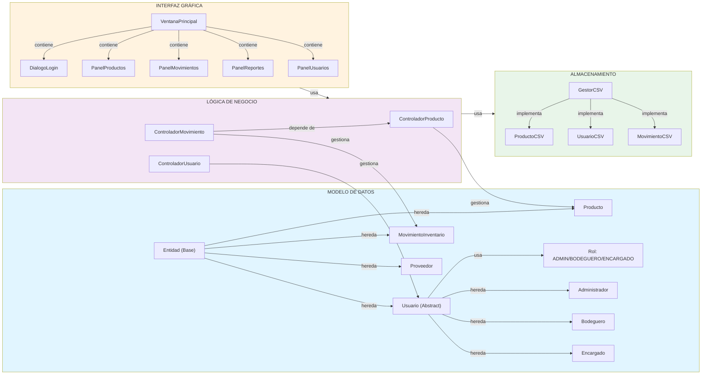
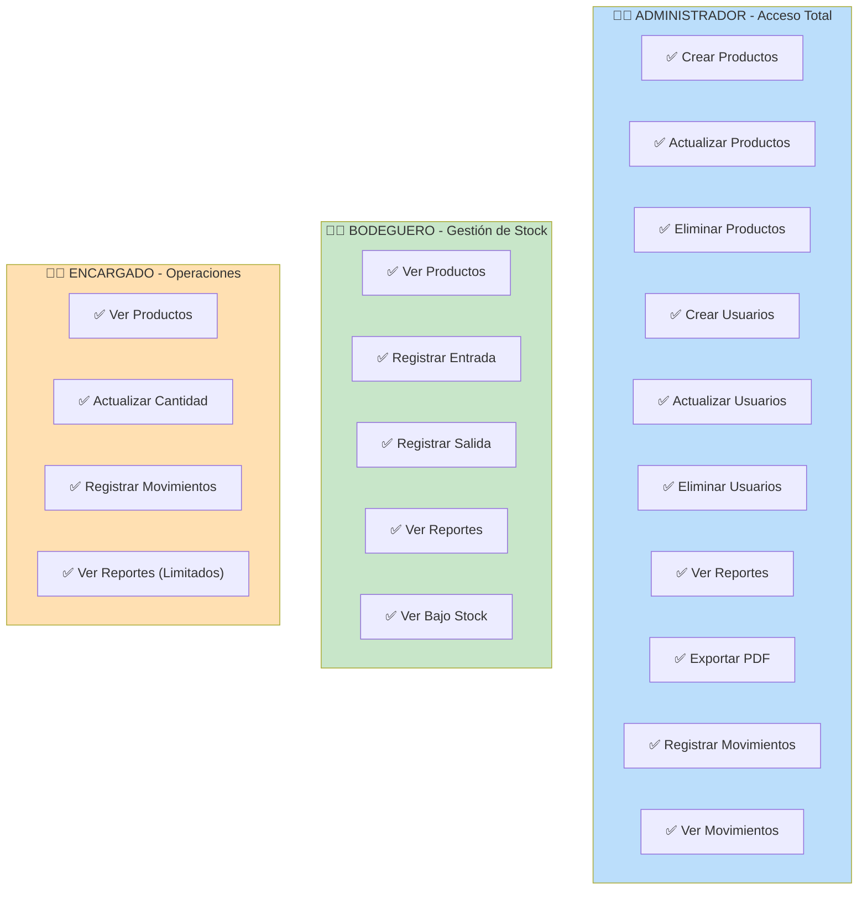
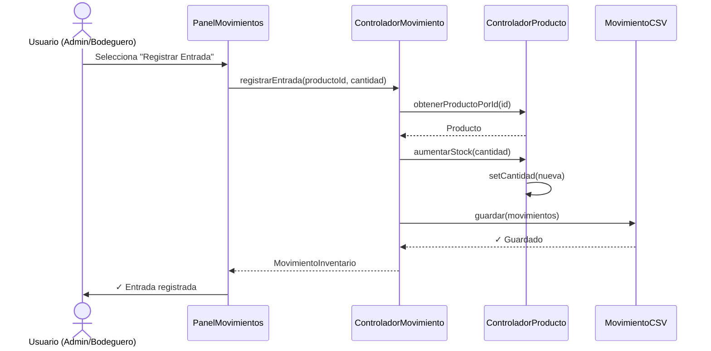
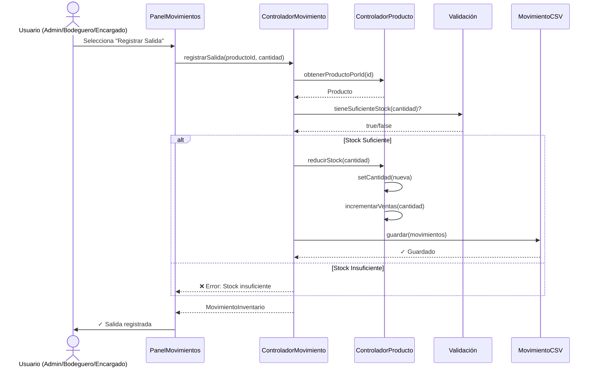
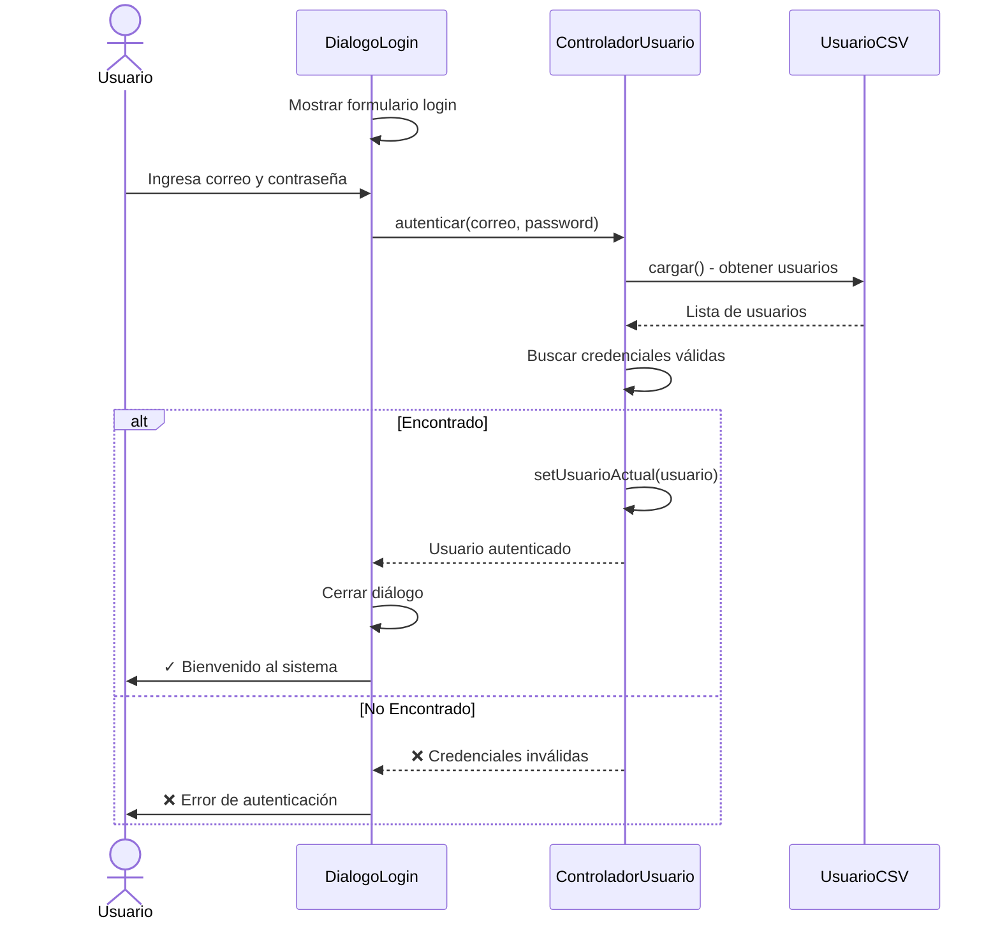
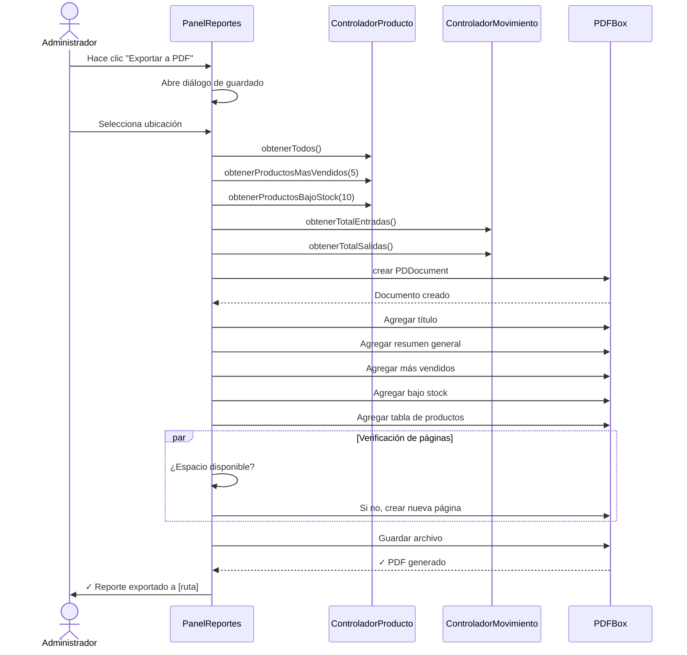
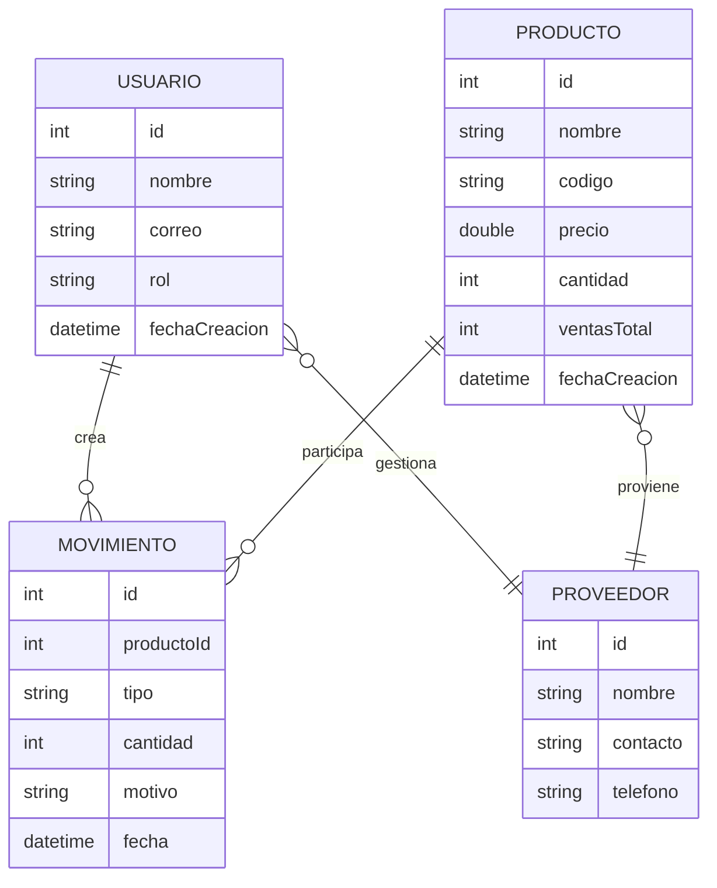

# 📊 Resumen Visual - Diagramas del Sistema

## Diagrama de Clases - Vista General



---

## Casos de Uso por Rol - Vista Simplificada



---

## Ciclo de Vida de Transacciones

### Entrada de Producto



### Salida de Producto (Venta)



---

## Flujo de Autenticación



---

## Flujo de Generación de Reportes y PDF



---

## Estructura de Datos - Relaciones



---

## Matriz de Características por Versión

### ✅ v1.0 Actual

| Feature | Estado | Descripción |
|---------|--------|-------------|
| CRUD Productos | ✅ | Crear, leer, actualizar, eliminar |
| CRUD Usuarios | ✅ | Gestión de usuarios por roles |
| Autenticación | ✅ | Login con correo/contraseña |
| Movimientos | ✅ | Entrada/Salida de inventario |
| Reportes | ✅ | Dashboard de estadísticas |
| Exportar PDF | ✅ | Generar reportes en PDF |
| CSV Persistence | ✅ | Almacenamiento en archivos CSV |

### 🔮 v2.0 Planeado

| Feature | Estado | Descripción |
|---------|--------|-------------|
| Base de datos SQL | ⏳ | Migrar de CSV a SQL |
| Gráficos | ⏳ | Visualización de datos |
| Backup automático | ⏳ | Respaldos programados |
| API REST | ⏳ | Integración con otros sistemas |
| Mobile app | ⏳ | Aplicación móvil |

---

## Métricas del Proyecto

```
📊 ESTADÍSTICAS DEL CÓDIGO

Total de Clases: 26
├── Modelos: 8
├── Controladores: 3
├── GUI: 8
├── Persistencia: 4
└── Excepciones: 2

Líneas de Código: ~3,500
├── Java: ~3,400
├── XML (pom.xml): ~100
└── Documentación: ~2,500

Dependencias: 1
└── Apache PDFBox 2.0.27

Archivos de Datos: 3
├── productos.csv
├── usuarios.csv
└── movimientos.csv
```

---

## 🎯 Conclusión

Este sistema proporciona una solución completa para la gestión de inventarios con:

✅ **Arquitectura clara** - Capas bien definidas  
✅ **Seguridad** - Autenticación y roles  
✅ **Persistencia** - Almacenamiento en CSV  
✅ **Reportes** - Análisis con exportación a PDF  
✅ **Escalabilidad** - Preparado para mejoras futuras  

---

**Generado: 18 de Mayo de 2026**  
**Sistema: Gestión de Inventario STF GROUP v1.0**
